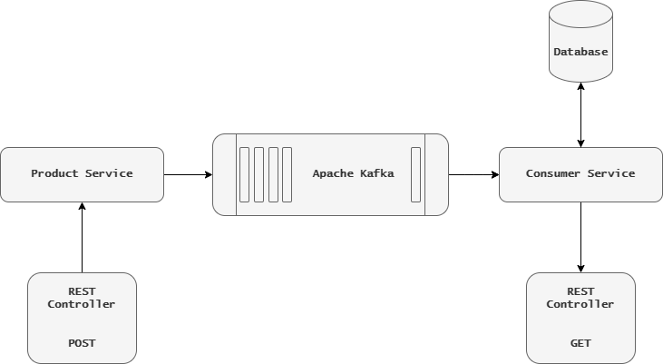

# Система мониторинга с использованием Kafka

### Описание:
Система мониторинга, которая отслеживает работу различных компонентов приложения с помощью Kafka. Эта система включает в себя "Producer" для отправки метрик, "Consumer" для их обработки и анализа, а также REST API для просмотра метрик.

### Требования:
#### Producer Service
- Создать микросервис "Metrics Producer", который будет отслеживать и собирать метрики работы приложения и отправлять их в Kafka, топик "metrics-topic"
- Реализовать следующие API для взаимодействия с микросервисом:
  - POST /metrics: Отправка метрик работы приложения в формате JSON. Метрики могут включать информацию о производительности, использовании ресурсов, ошибках и т. д.

#### Customer Service
- Создать микросервис "Metrics Consumer", который будет принимать метрики из Kafka, топика "metrics-topic" и анализировать их для выявления проблем и трендов 
- Реализовать обработку метрик и вывод статистики в логи или базу данных для последующего анализа
- Реализовать REST API в микросервисе "Metrics Consumer" для просмотра метрик.
  - GET /metrics: Получение списка всех метрик
  - GET /metrics/{id}: Получение конкретной метрики по ее идентификатору
---

### Технологии:
- Java 17
- Spring Boot
- Apache Kafka
- PostgreSQL
- H2 Database
- Maven
- Lombok
- Docker
- Swagger
---

### Архитектура приложения

___

### Запуск приложения:
1. Склонируйте репозиторий командой: git clone git@github.com:weare4saken/kafka-metrics-system.git
2. Настройте *username* и *password* для БД в файле consumer-service/src/main/resources/application.yaml
3. Запустить одну из следующих конфигураций docker-compose:
   - Конфигурация по умолчанию (на основе БД H2)
    ```
    docker-compose up -d
    ```
   - Запустить только Apache Kafka:
    ```
    docker-compose -f docker-compose-kafka.yaml up -d
    ```
4. Swagger будет доступен по ссылкам:
   - `Producer Service` - [http://localhost:8080/swagger-ui.html](http://localhost:8080/swagger-ui.html)
   - `Consumer Service` - [http://localhost:8081/swagger-ui.html](http://localhost:8081/swagger-ui.html)